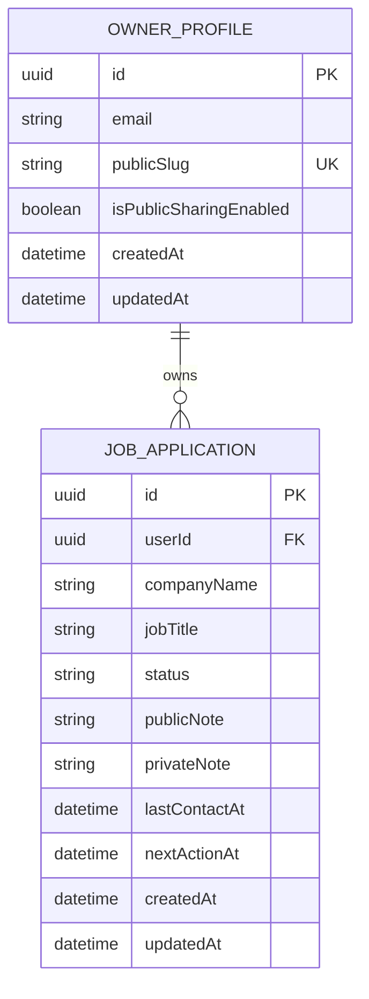

# MVP Entity Relationship Model

This ERD shows the product-facing data model for the MVP.

Identity tables are owned by ASP.NET Identity and should be treated as internal auth storage. The application should expose an `OWNER_PROFILE`-level model to the product rather than leaking Identity internals into public or dashboard DTOs.
