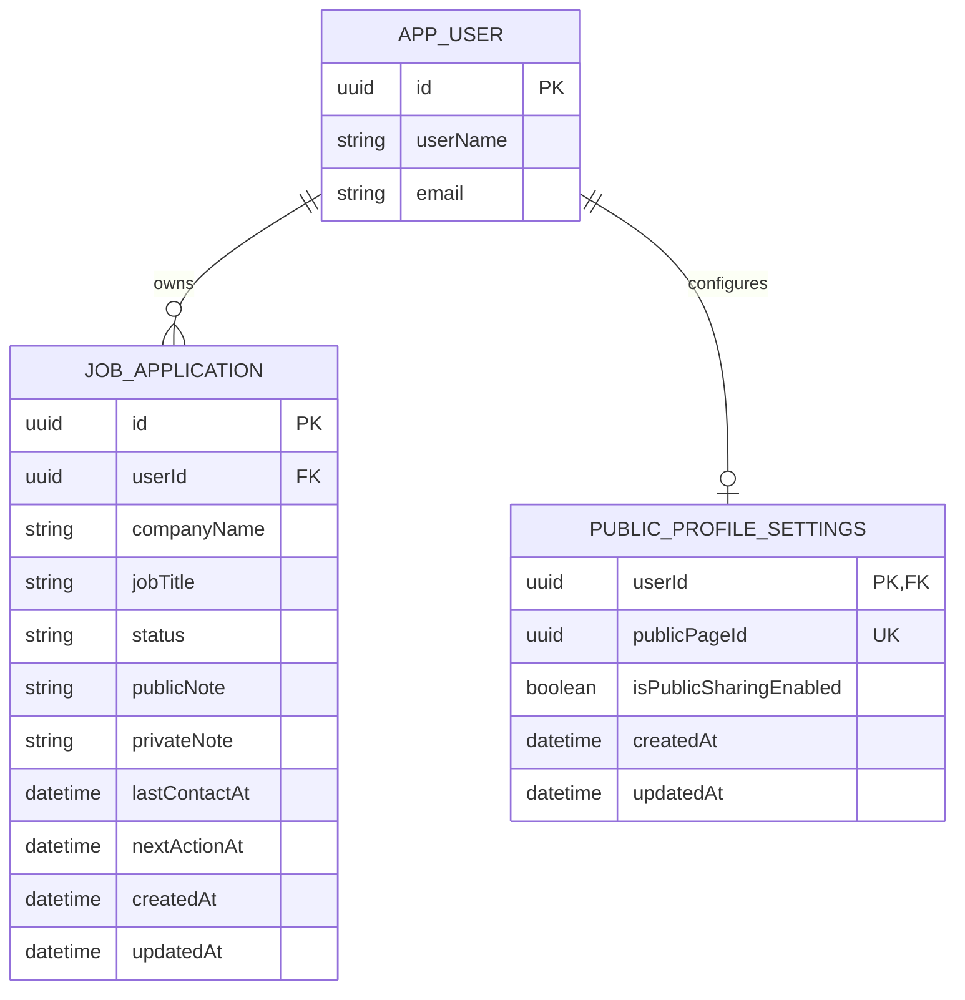

# MVP Entity Relationship Model

This ERD reflects the persisted application model. `APP_USER` shows only the relevant fields of ASP.NET Identity's `users` table; the remaining Identity tables and auth fields are omitted.

- `PublicProfileSettings` maps to `public_profile_settings`; `Application` maps to `applications`.
- Identity enforces username uniqueness through its normalized username index. Unique email addresses are required by the registration configuration.
- Each user has at most one settings row because `userId` is both its primary key and foreign key. Registration creates it with sharing disabled; settings access creates it for older users if it is missing.
- `publicPageId` is a unique random UUID v4, generated independently of the user's ID and username. Public links use `/status/{publicPageId}`.
- `PublicStatus` is a read-only projection of settings, the user's display name, and application fields, not another stored entity. It never exposes private notes or the user's ID.
- Anyone with the link can view the public fields while sharing is enabled. Disabling sharing hides them. Both relationships cascade on user deletion.

The `UsePublicPageIds` migration gives existing settings rows a fresh UUID and removes name-based slugs. Existing name-based links stop working and must be shared again from the dashboard. Sharing preferences and applications are preserved. Downgrading retains UUID-shaped links; it does not restore the old names.
