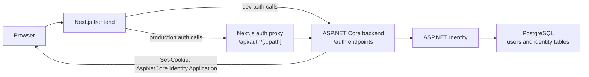
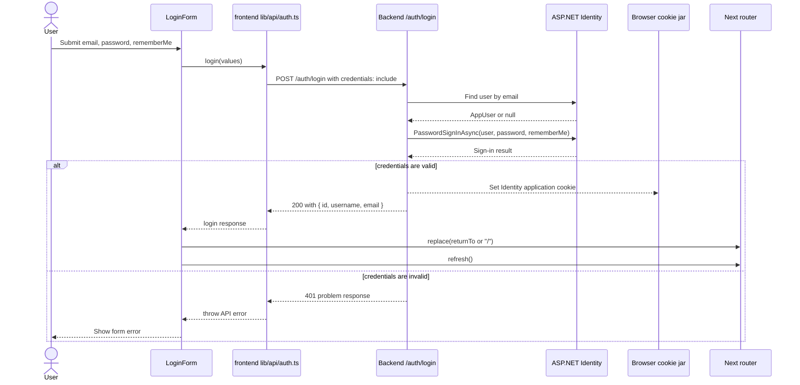
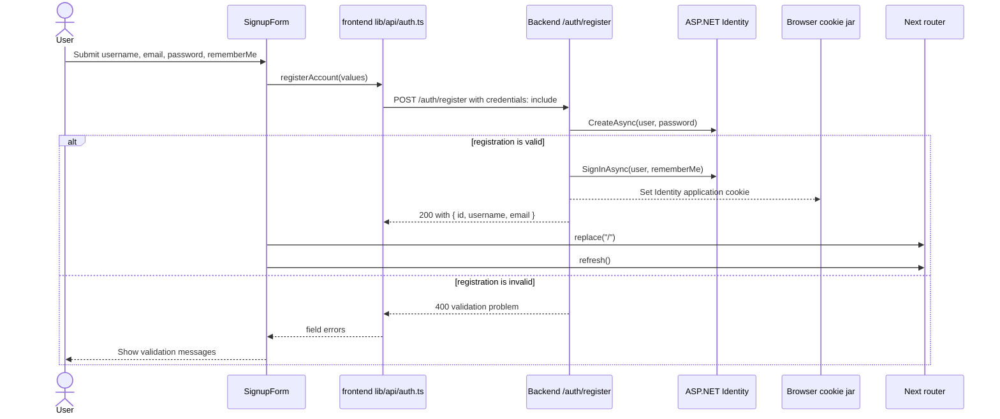
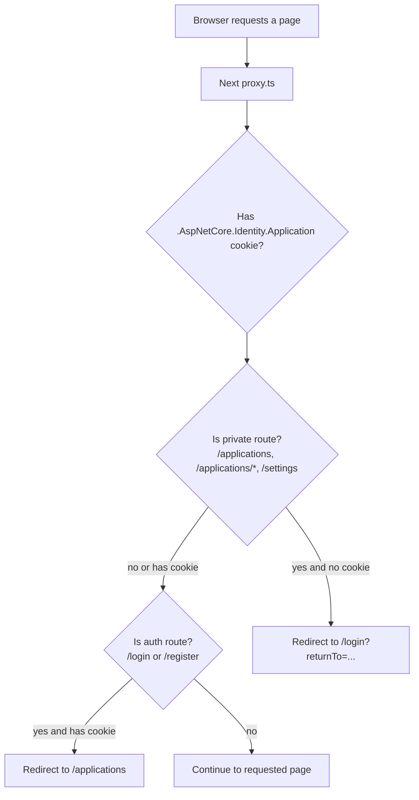
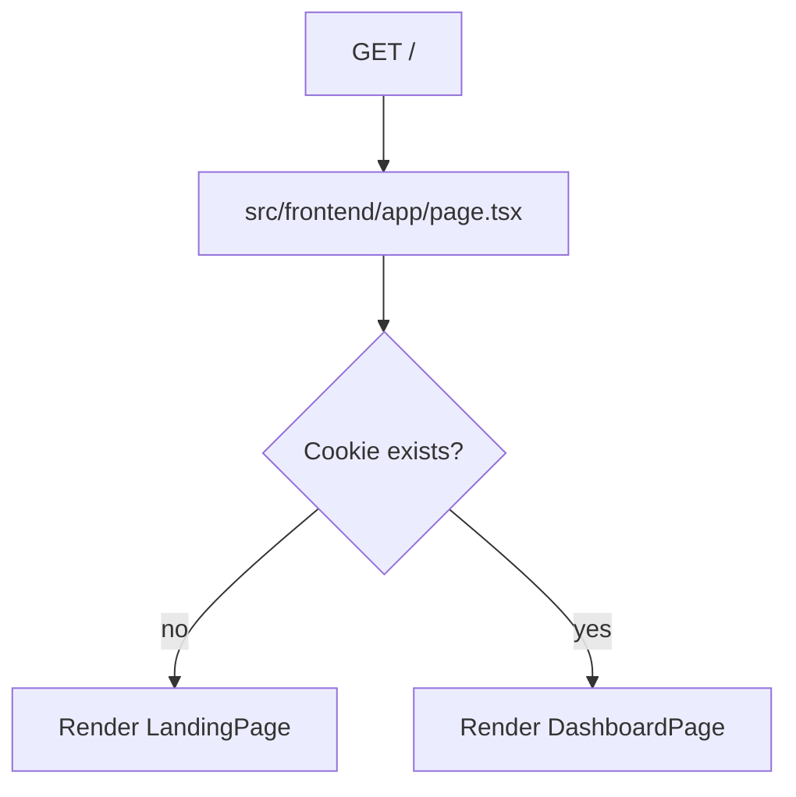
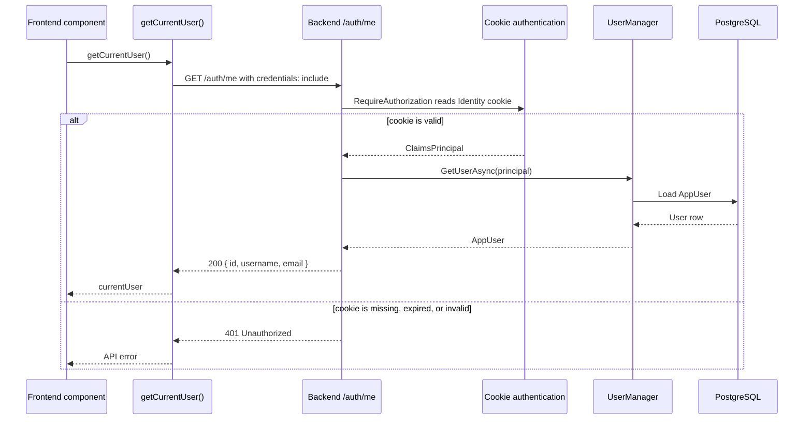
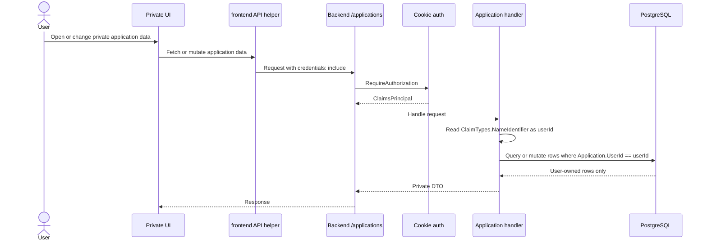
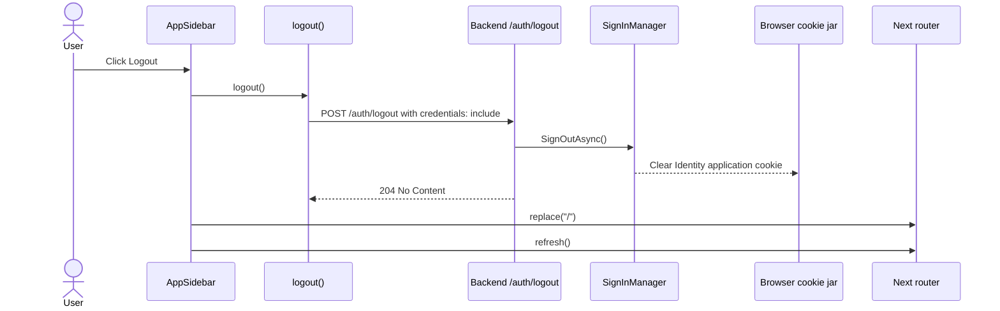
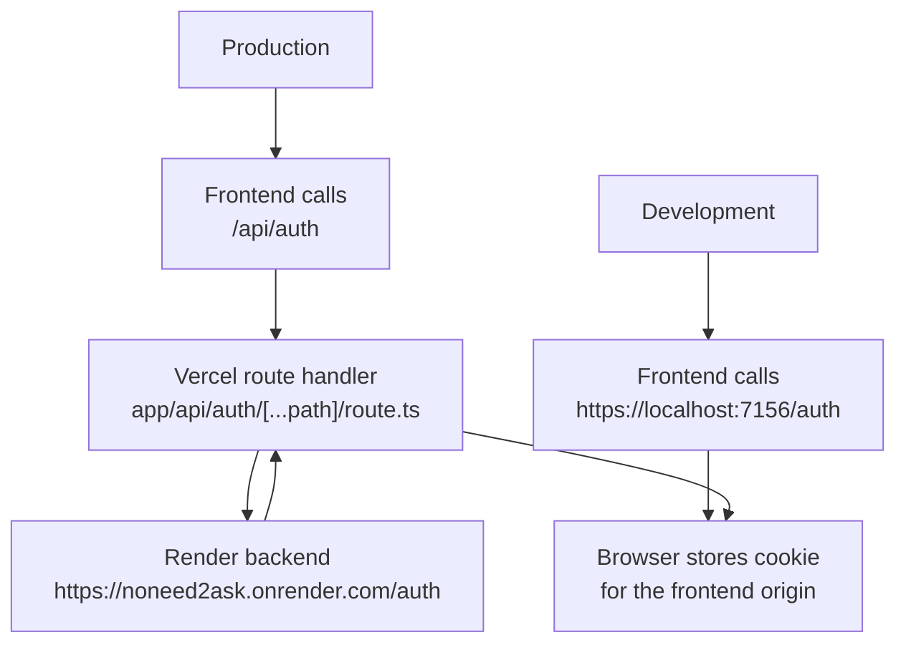
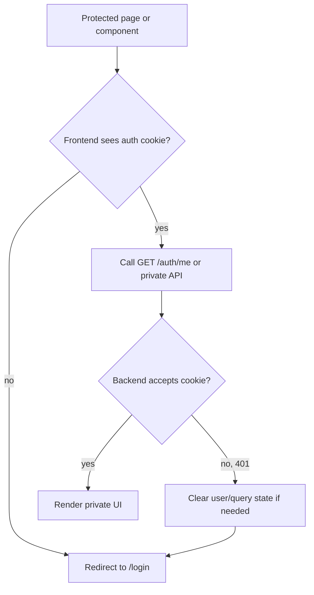

# Owner Authentication Flow

This document describes the implemented ASP.NET Identity cookie auth flow.
Use it when you need to remember how the frontend knows whether a user is logged in and how it learns who that user is.

## Important idea

The frontend does not decode the Identity cookie.

It uses the cookie in two ways:

- Route/layout checks only ask: "Does the `.AspNetCore.Identity.Application` cookie exist?"
- User identity is loaded by calling `GET /auth/me`, which asks the backend to turn the cookie into `{ id, username, email }`.

Relevant files:

- Backend auth setup: `src/backend/Features/DependencyInjection.cs`
- Backend auth endpoints: `src/backend/Features/Auth/*`
- Frontend auth API helpers: `src/frontend/lib/api/auth.ts`
- Frontend cookie name: `src/frontend/lib/auth/cookies.ts`
- Frontend route gate: `src/frontend/proxy.ts`
- Frontend app shell check: `src/frontend/app/layout.tsx`
- Production auth proxy: `src/frontend/app/api/auth/[...path]/route.ts`

## Auth responsibility map



## Login sequence



Notes:

- `PasswordSignInAsync` is the moment the auth session is created.
- The login response contains user info, but the app should not rely on that response forever. After reloads, the durable session state is the cookie.
- `rememberMe` controls whether the Identity cookie is persistent.

## Register sequence



## Route gating in the frontend



Important limitation:

The route gate only checks whether the cookie exists. It does not prove the cookie is still valid. The backend remains the source of truth. If the cookie is expired or invalid, protected API calls and `GET /auth/me` return `401`.

## Home page decision



Current implementation detail:

The dashboard currently renders fixture data. The sidebar already fetches the current user through `GET /auth/me`.

## How the frontend knows who the user is



This is the answer to: "How does the frontend know who the user is?"

It asks the backend. The backend reads the Identity cookie, resolves the `ClaimsPrincipal`, loads the user, and returns a small current-user DTO.

## Private application data flow



The backend ownership rule is what protects data:

```text
authenticated user id from cookie claims == Application.UserId
```

Do not let the frontend send a `userId` to decide ownership.

## Logout sequence



## Local development vs production auth calls



Why production is different:

- In development, both apps run on `localhost`, so the cookie can be visible to the frontend despite different ports.
- In production, Vercel and Render are different hosts.
- The auth proxy keeps the Identity cookie on the frontend origin so Next.js route checks can see it.

## Failure and recovery flow



Recommended behavior:

- Use cookie existence for fast route decisions.
- Use `GET /auth/me` for real user identity.
- Treat `401` from `/auth/me` or private endpoints as logged out.
- Redirect to `/login` when the backend rejects the cookie.
