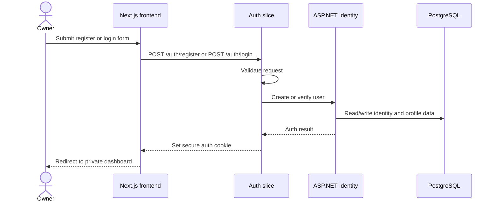

# Owner Authentication Flow

This sequence shows how register/login creates an authenticated owner session.

```mermaid
sequenceDiagram
    actor Owner
    participant Web as Next.js frontend
    participant Api as Auth slice
    participant Identity as ASP.NET Identity
    participant Db as PostgreSQL

    Owner->>Web: Submit register or login form
    Web->>Api: POST /auth/register or POST /auth/login
    Api->>Api: Validate request
    Api->>Identity: Create or verify user
    Identity->>Db: Read/write identity and profile data
    Identity-->>Api: Auth result
    Api-->>Web: Set secure auth cookie
    Web-->>Owner: Redirect to private dashboard
```
