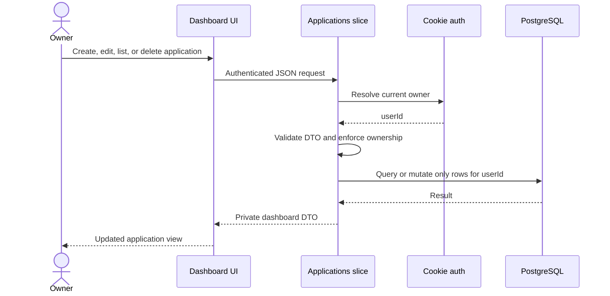

# Private Application Management Flow

This sequence shows the ownership boundary for private dashboard operations.

```mermaid
sequenceDiagram
    actor Owner
    participant Web as Dashboard UI
    participant Api as Applications slice
    participant Auth as Cookie auth
    participant Db as PostgreSQL

    Owner->>Web: Create, edit, list, or delete application
    Web->>Api: Authenticated JSON request
    Api->>Auth: Resolve current owner
    Auth-->>Api: userId
    Api->>Api: Validate DTO and enforce ownership
    Api->>Db: Query or mutate only rows for userId
    Db-->>Api: Result
    Api-->>Web: Private dashboard DTO
    Web-->>Owner: Updated application view
```
