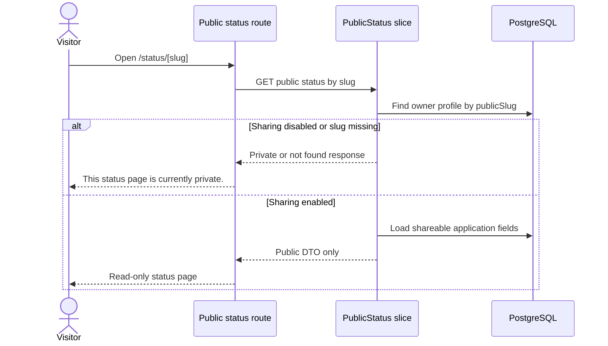

# Public Status Page Flow

This sequence shows how the public read-only status page avoids exposing private owner data.

The most important rule in this flow is the DTO boundary: public responses may include `companyName`, `jobTitle`, `status`, `publicNote`, `updatedAt`, and `nextActionAt`; they must never include `privateNote`, `userId`, Identity data, or owner-only settings.
