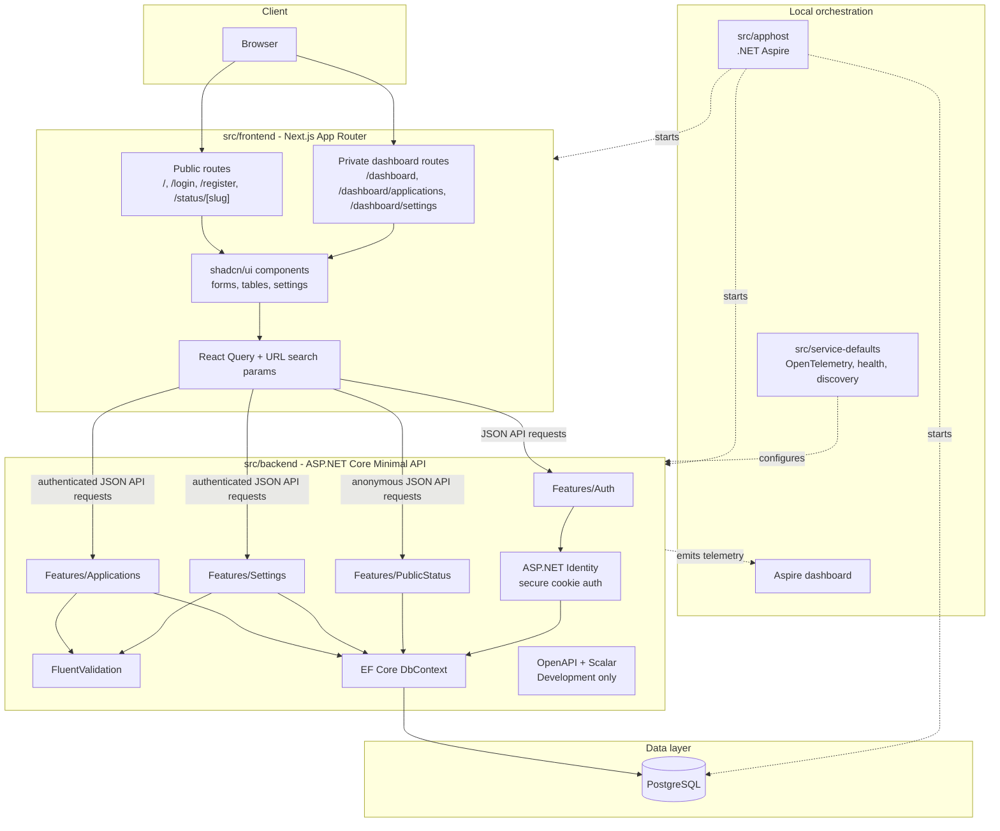

# Runtime Container Architecture

This diagram shows the target runtime shape across the frontend, backend, data layer, and local Aspire orchestration.

```mermaid
flowchart TB
    subgraph Client["Client"]
        Browser["Browser"]
    end

    subgraph Frontend["src/frontend - Next.js App Router"]
        PublicRoutes["Public routes\n/, /login, /register, /status/[slug]"]
        PrivateRoutes["Private dashboard routes\n/dashboard, /dashboard/applications, /dashboard/settings"]
        UI["shadcn/ui components\nforms, tables, settings"]
        QueryState["React Query + URL search params"]
    end

    subgraph Backend["src/backend - ASP.NET Core Minimal API"]
        AuthSlice["Features/Auth"]
        ApplicationsSlice["Features/Applications"]
        SettingsSlice["Features/Settings"]
        PublicStatusSlice["Features/PublicStatus"]
        Validation["FluentValidation"]
        EfCore["EF Core DbContext"]
        CookieAuth["ASP.NET Identity\nsecure cookie auth"]
        OpenApi["OpenAPI + Scalar\nDevelopment only"]
    end

    subgraph Data["Data layer"]
        Postgres[("PostgreSQL")]
    end

    subgraph Ops["Local orchestration"]
        Aspire["src/apphost\n.NET Aspire"]
        ServiceDefaults["src/service-defaults\nOpenTelemetry, health, discovery"]
        AspireDashboard["Aspire dashboard"]
    end

    Browser --> PublicRoutes
    Browser --> PrivateRoutes
    PublicRoutes --> UI
    PrivateRoutes --> UI
    UI --> QueryState

    QueryState -->|JSON API requests| AuthSlice
    QueryState -->|authenticated JSON API requests| ApplicationsSlice
    QueryState -->|authenticated JSON API requests| SettingsSlice
    QueryState -->|anonymous JSON API requests| PublicStatusSlice

    AuthSlice --> CookieAuth
    ApplicationsSlice --> Validation
    SettingsSlice --> Validation
    ApplicationsSlice --> EfCore
    SettingsSlice --> EfCore
    PublicStatusSlice --> EfCore
    CookieAuth --> EfCore
    EfCore --> Postgres

    Aspire -. starts .-> Frontend
    Aspire -. starts .-> Backend
    Aspire -. starts .-> Postgres
    ServiceDefaults -. configures .-> Backend
    Backend -. emits telemetry .-> AspireDashboard
```
