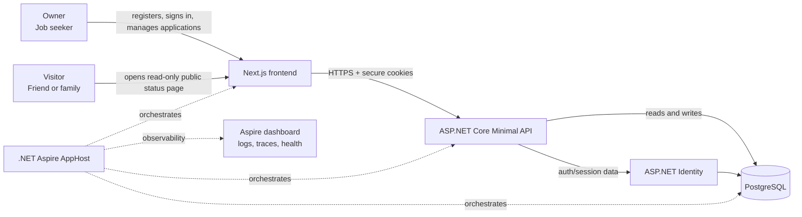

# System Context

This diagram shows the major users and system boundaries for the target MVP.

```mermaid
flowchart LR
    Owner["Owner\nJob seeker"] -->|registers, signs in, manages applications| Frontend["Next.js frontend"]
    Visitor["Visitor\nFriend or family"] -->|opens read-only public status page| Frontend

    Frontend -->|HTTPS + secure cookies| Api["ASP.NET Core Minimal API"]
    Api -->|reads and writes| Db[("PostgreSQL")]
    Api -->|auth/session data| Identity["ASP.NET Identity"]
    Identity --> Db

    AppHost[".NET Aspire AppHost"] -. orchestrates .-> Frontend
    AppHost -. orchestrates .-> Api
    AppHost -. orchestrates .-> Db
    AppHost -. observability .-> Dashboard["Aspire dashboard\nlogs, traces, health"]
```
